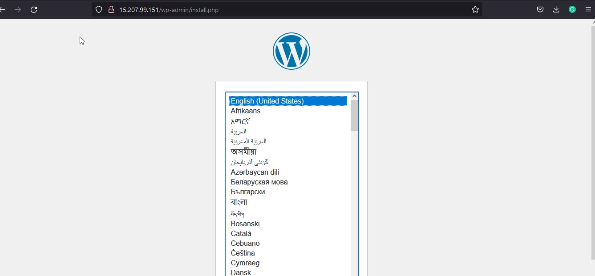
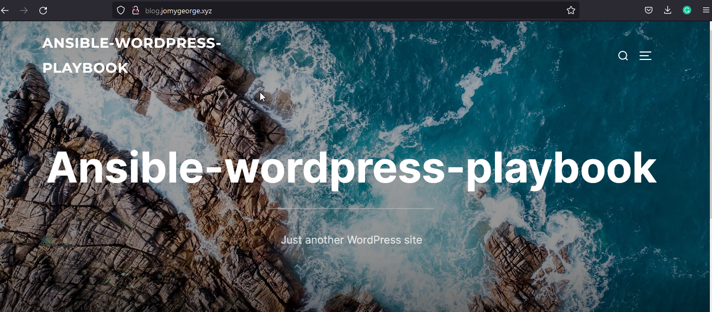

# Ansible-playbook-wordpress-LAMP

[](https://travis-ci.org/joemccann/dillinger)

---

## Description 

Ansible playbook for creating the Mariadb, Php, Wordpress and Apache on client node using Ansible Master node. 

----
## Pre-Requests
- Need to install Ansible on Master node to run
-----

## Includes

- Mariadb
- php
- wordpress
- Apache

### Ansible installation 

```sh
sudo amazon-linux-extras install ansible2 -y

ansible --version
ansible 2.9.23
  config file = /etc/ansible/ansible.cfg
  configured module search path = [u'/home/ec2-user/.ansible/plugins/modules', u'/usr/share/ansible/plugins/modules']
  ansible python module location = /usr/lib/python2.7/site-packages/ansible
  executable location = /usr/bin/ansible
  python version = 2.7.18 (default, Jun 10 2021, 00:11:02) [GCC 7.3.1 20180712 (Red Hat 7.3.1-13)]
```


### Behind the code : hosts file
```sh
[amazon]                                                                                          >>>>  Group name i have provided
<server IP> ansible_user="ec2-user" ansible_port=22 ansible_ssh_private_key_file="ansible.pem"
```
### Behind the code : main.yml
```sh
---

- name: "Installing Lampstack On Amazon Linux servers. Lets roll"
  become: true
  hosts: amazon
  vars:
    httpd_port: "80"
    httpd_user: "apache"
    httpd_group: "apache"
    httpd_domain: "blog.jomygeorge.xyz"            >>>>>>>>>>>>> You need to change the domain name
    mysql_root_password: "mysqlpass@1"
    mysql_user: "wordpress"
    mysql_user_password: "wordpress"
    mysql_database: "wordpress"
    wordpress_url: "https://wordpress.org/latest.tar.gz"
  tasks:
    
    - name: "HTTPD WEBSERVER - Installing Packages. Please wait"
      yum:
        name: httpd
        state: present

        
    - name: "HTTPD WEBSERVER - Installing php7.4 "
      shell: amazon-linux-extras install php7.4 -y
        
        
    - name: "HTTPD WEBSERVER -  Creating httpd configuration file"
      template:
        src: "httpd.conf.tmpl"
        dest: "/etc/httpd/conf/httpd.conf"
        owner: "root"
        group: "root"

        
    - name: "HTTPD WEBSERVER - Creating VirtalHost for domain {{ httpd_domain }}"
      template:
        src: "virtualhost.conf.tmpl"
        dest: "/etc/httpd/conf.d/{{httpd_domain}}.conf"
        owner: "{{ httpd_user }}"
        group: "{{ httpd_group }}"
 
        
        
    - name: "HTTPD WEBSERVER - Creating documentRoot for our domain virtualhost {{ httpd_domain }}"
      file:
        path: "/var/www/html/{{ httpd_domain }}"
        state: directory
        owner: "{{ httpd_user }}"
        group: "{{ httpd_group }}"

        
        
    - name: "HTTPD WEBSERVER - Creating simple test.html page and text.php for check"
      copy:
        src: "{{ item }}"
        dest: "/var/www/html/{{ httpd_domain }}"
        owner: "{{ httpd_user }}"
        group: "{{ httpd_group }}"
      with_items:
        - test.html
        - test.php

    
    - name: "HTTPD WEBSERVER - httpd restart"
      service:
        name: httpd
        state: restarted
        enabled: true
            
    - name: "Mariadb-Server - Installation"
      yum:
        name: 
          - mariadb-server
          - MySQL-python
        state: present
            
        
    - name: "Mariab - Restarting and enabling"
      service:
        name: mariadb
        state: restarted
        enabled: true
   

    - name: "Mariadb - Setting Root password for mysql"
      ignore_errors: true
      mysql_user:
        login_user: "root"
        login_password: ""
        user: "root"
        password: "{{ mysql_root_password }}"
        host_all: true
  

    - name: "Mariadb - Removing Anonymous User from mariadb"
      mysql_user:
        login_user: "root"
        login_password: "{{ mysql_root_password }}"
        user: ""
        host_all: true
        state: absent
            
            
    - name: "Mariadb - Removing the test Database"
      mysql_db:
        login_user: "root"
        login_password: "{{ mysql_root_password }}"
        name: "test"
        state: absent
            
    - name: "Mariadb - Creating Extra database for the wordpress -->  {{ mysql_database }}"
      mysql_db:
        login_user: "root"
        login_password: "{{ mysql_root_password }}"
        name: "{{ mysql_database }}"
        state: present
            
    - name: "Mariadb - Creating one extra User {{ mysql_user }}"
      mysql_user:
        login_user: "root"
        login_password: "{{ mysql_root_password }}"
        user: "{{ mysql_user }}"
        host: "localhost"
        state: present
        password: "{{ mysql_user_password }}" 
        priv: "{{ mysql_database }}.*:ALL"
            
    - name: "Wordpress - Downloading the tar File from official site"
      get_url:
        url: "{{ wordpress_url }}"
        dest: "/tmp/wordpress.tar.gz"
            
    - name: "Wordpress - Extracting the tar File which downloaded"
      unarchive:
        src: "/tmp/wordpress.tar.gz"
        dest: /tmp/
        remote_src: true
            
    - name: "Wordpress - Copying the Wordpress extrated files to documentroot"
      copy:
        src: /tmp/wordpress/
        dest: "/var/www/html/{{ httpd_domain }}"
        remote_src: true
        owner: "{{ httpd_user }}"
        group: "{{ httpd_group }}"
            
    - name: "Wordpress - Creating custom wp-config.php to remote"
      template:
        src: wp-config.php.tmpl
        dest: "/var/www/html/{{ httpd_domain }}/wp-config.php"
        owner: "{{ httpd_user }}"
        group: "{{ httpd_group }}"
            
    - name: "Post-Installation restart for installed service"
      service:
        name: "{{ item }}"
        state: restarted
        enabled: true
      with_items:
        - httpd
        - mariadb
        
    - name: "Post-Instalaltion - Cleanup like downloaded tar and extrated wordpress files"
      file:
        path: "{{ item }}"
        state: absent
      with_items:
        - "/tmp/wordpress.tar.gz"
        - "/tmp/wordpress/"
```

### Behind the code : virtualhost.conf.tmpl
```
<virtualhost *:{{ httpd_port }}>

  servername {{ httpd_domain }}
  documentroot /var/www/html/{{ httpd_domain }}
  directoryindex index.php index.html

  <directory "/var/www/html/{{ httpd_domain }}">
     allowoverride all
  </directory>

</virtualhost>
```

### Behind the code : wp-config.php.tmpl
```
You need to provide the variable name on wp-config.php.tmpl as i have uploaded above
```

### Behind the code : httpd.conf.tmpl
```
You need to provide the variable name on httpd.conf.tmpl as i have uploaded above
```

> Lets us check the syntax of our code using below
```
 ~]$ ansible-playbook -i hosts main.yml --syntax-check
playbook: main.yml
```
> Let run the code and call the domain name on browser to access the wordpress dashboard

```
[ec2-user@ip-172-31-0-122 ~]$ ansible-playbook -i hosts main.yml

PLAY [Installing Lampstack On Amazon Linux servers. Lets roll] *********************************************************************************************************

TASK [Gathering Facts] *************************************************************************************************************************************************
[WARNING]: Platform linux on host 172.31.9.224 is using the discovered Python interpreter at /usr/bin/python, but future installation of another Python interpreter
could change this. See https://docs.ansible.com/ansible/2.9/reference_appendices/interpreter_discovery.html for more information.
ok: [172.31.9.224]

TASK [HTTPD WEBSERVER - Installing Packages. Please wait] **************************************************************************************************************
ok: [172.31.9.224]

TASK [HTTPD WEBSERVER - Installing php7.4] *****************************************************************************************************************************
changed: [172.31.9.224]

TASK [HTTPD WEBSERVER -  Creating httpd configuration file] ************************************************************************************************************
ok: [172.31.9.224]

TASK [HTTPD WEBSERVER - Creating VirtalHost for domain blog.jomygeorge.xyz] ********************************************************************************************
ok: [172.31.9.224]

TASK [HTTPD WEBSERVER - Creating documentRoot for our domain virtualhost blog.jomygeorge.xyz] **************************************************************************
ok: [172.31.9.224]

TASK [HTTPD WEBSERVER - Creating simple test.html page and text.php for check] *****************************************************************************************
ok: [172.31.9.224] => (item=test.html)
ok: [172.31.9.224] => (item=test.php)

TASK [HTTPD WEBSERVER - httpd restart] *********************************************************************************************************************************
changed: [172.31.9.224]

TASK [Mariadb-Server - Installation] ***********************************************************************************************************************************
changed: [172.31.9.224]

TASK [Mariab - Restarting and enabling] ********************************************************************************************************************************
changed: [172.31.9.224]

TASK [Mariadb - Setting Root password for mysql] ***********************************************************************************************************************
[WARNING]: Module did not set no_log for update_password
changed: [172.31.9.224]

TASK [Mariadb - Removing Anonymous User from mariadb] ******************************************************************************************************************
changed: [172.31.9.224]

TASK [Mariadb - Removing the test Database] ****************************************************************************************************************************
changed: [172.31.9.224]

TASK [Mariadb - Creating Extra database for the wordpress -->  wordpress] **********************************************************************************************
changed: [172.31.9.224]

TASK [Mariadb - Creating one extra User wordpress] *********************************************************************************************************************
changed: [172.31.9.224]

TASK [Wordpress - Downloading the tar File from official site] *********************************************************************************************************
changed: [172.31.9.224]

TASK [Wordpress - Extracting the tar File which downloaded] ************************************************************************************************************
changed: [172.31.9.224]

TASK [Wordpress - Copying the Wordpress extrated files to documentroot] ************************************************************************************************
changed: [172.31.9.224]

TASK [Wordpress - Creating custom wp-config.php to remote] *************************************************************************************************************
changed: [172.31.9.224]

TASK [Post-Installation restart for installed service] *****************************************************************************************************************
changed: [172.31.9.224] => (item=httpd)
changed: [172.31.9.224] => (item=mariadb)

TASK [Post-Instalaltion - Cleanup like downloaded tar and extrated wordpress files] ************************************************************************************
changed: [172.31.9.224] => (item=/tmp/wordpress.tar.gz)
changed: [172.31.9.224] => (item=/tmp/wordpress/)

PLAY RECAP *************************************************************************************************************************************************************
172.31.9.224               : ok=21   changed=15   unreachable=0    failed=0    skipped=0    rescued=0    ignored=0

```
<center>  </img></center>

<center> </img></center>

 ## Conclusion

Created the wordpress with php, mysql, apache using ansible playbook


#### ⚙️ Connect with Me

<p align="center">
<a href="mailto:jomyambattil@gmail.com"></a>
<a href="https://www.linkedin.com/in/jomygeorge11"></a> 
<a href="https://www.instagram.com/therealjomy"></a><br />
